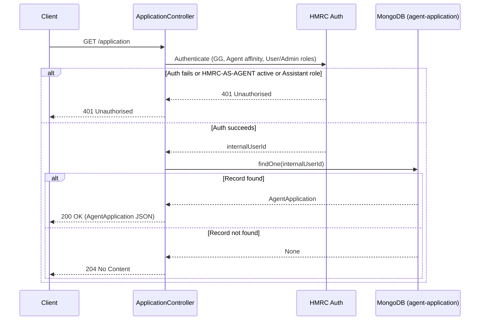

# AR01 – Get Agent Application by Internal User ID

## Overview
Retrieves an agent application record for the currently authenticated user, identified by their internal user ID. This endpoint is used during the agent registration journey to check for an existing in-progress application. Returns 204 (not 404) when no record is found to avoid revealing the absence of data.

## API Details

| Field              | Value                                              |
|--------------------|----------------------------------------------------|
| Method             | GET                                                |
| Path               | `/application`                                     |
| Controller         | `ApplicationController`                            |
| Controller Method  | `findByInternalUserId`                             |
| Audience           | Agent (Government Gateway)                         |
| Criticality        | High                                               |

## Authentication

- **Type:** Government Gateway (GG)
- **Affinity Group:** Agent
- **Credential Roles:** User or Admin
- **Notes:** The `HMRC-AS-AGENT` enrolment must **not** be active — this endpoint is only for agents who have not yet completed registration. Users with the Assistant credential role are rejected. Both conditions are enforced in the auth action.

## Path Parameters

None

## Query Parameters

None

## Response

| Status Code | Description                                           |
|-------------|-------------------------------------------------------|
| 200         | Agent application found; returns `AgentApplication` JSON |
| 204         | No application found for this internal user ID        |
| 401         | Unauthorised — auth failed, HMRC-AS-AGENT active, or Assistant role |

## Service Architecture

The request is authenticated via HMRC Auth, which returns the caller's `internalUserId`. The controller then queries the `agent-application` MongoDB collection for a document matching that ID. The collection has a unique index on `internalUserId` and a TTL index on `lastUpdated`.

## Interaction Flow

## Dependencies

- **HMRC Auth** — Government Gateway authentication and authorisation

## Database Collections

| Collection          | Operation | Filter           |
|---------------------|-----------|------------------|
| `agent-application` | findOne   | `internalUserId` |

## Special Cases

- Returns **204** (not 404) when no application record exists
- Rejects requests where the `HMRC-AS-AGENT` enrolment is active
- Rejects users with the **Assistant** credential role
- Collection has a **TTL index** on `lastUpdated` — records expire automatically
- Unique index on `internalUserId` and `linkId`

## Error Handling

- **401** is returned for any authentication or authorisation failure, including active `HMRC-AS-AGENT` enrolment or disallowed credential role
- MongoDB errors propagate as 500 Internal Server Error

## Performance Considerations

- Query uses a unique index on `internalUserId` — O(1) lookup
- Fully asynchronous (Play `Action.async`)
- No caching layer

## Notes

This endpoint acts as the "resume journey" check for the agent registration flow. Because agents may be in mid-registration, the service deliberately rejects already-enrolled agents to prevent double-registration.

## Document Metadata

| Field             | Value                    |
|-------------------|--------------------------|
| API ID            | AR01                     |
| Last Updated      | 2025-07-14               |
| Git Commit SHA    | N/A                      |
| Analysis Version  | 1.0                      |
