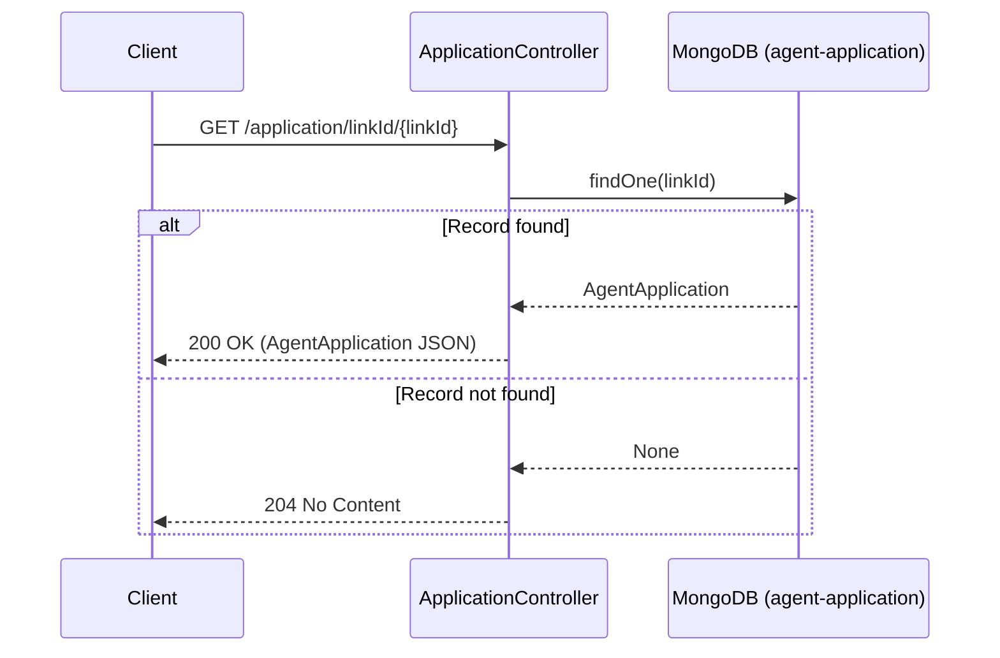

# AR02 – Get Agent Application by Link ID

## Overview
Retrieves an agent application record by its `linkId`, a unique reference used to share or link application records between journeys. This endpoint requires no authentication and is intended for unauthenticated lookup scenarios such as shared application links. Returns 204 (not 404) when no record is found.

## API Details

| Field              | Value                                              |
|--------------------|----------------------------------------------------|
| Method             | GET                                                |
| Path               | `/application/linkId/{linkId}`                     |
| Controller         | `ApplicationController`                            |
| Controller Method  | `findByLinkId`                                     |
| Audience           | Unauthenticated                                    |
| Criticality        | High                                               |

## Authentication

- **Type:** None
- **Notes:** This endpoint uses `Action.async` with no authentication wrapper. Any caller with network access can invoke it. Access control is achieved by the obscurity and uniqueness of the `linkId` value itself.

## Path Parameters

| Parameter | Type   | Description                              |
|-----------|--------|------------------------------------------|
| `linkId`  | String | Unique link identifier for the application |

## Query Parameters

None

## Response

| Status Code | Description                                        |
|-------------|----------------------------------------------------|
| 200         | Application found; returns `AgentApplication` JSON |
| 204         | No application found for this link ID              |

## Service Architecture

No authentication check is performed. The controller queries the `agent-application` MongoDB collection directly using the `linkId` path parameter. The collection has a unique index on `linkId`, making this an efficient O(1) lookup.

## Interaction Flow

## Dependencies

None

## Database Collections

| Collection          | Operation | Filter    |
|---------------------|-----------|-----------|
| `agent-application` | findOne   | `linkId`  |

## Special Cases

- Returns **204** (not 404) when no application record exists
- **No authentication required** — access is governed by knowledge of the `linkId`
- `linkId` has a unique index in the collection

## Error Handling

- No auth errors possible
- MongoDB errors propagate as 500 Internal Server Error

## Performance Considerations

- Query uses a unique index on `linkId` — O(1) lookup
- Fully asynchronous (Play `Action.async`)
- No caching layer

## Notes

The unauthenticated nature of this endpoint is intentional to support cross-journey scenarios where a link is shared (e.g. via email) to a party who may not be the original authenticated user.

## Document Metadata

| Field             | Value                    |
|-------------------|--------------------------|
| API ID            | AR02                     |
| Last Updated      | 2025-07-14               |
| Git Commit SHA    | N/A                      |
| Analysis Version  | 1.0                      |
