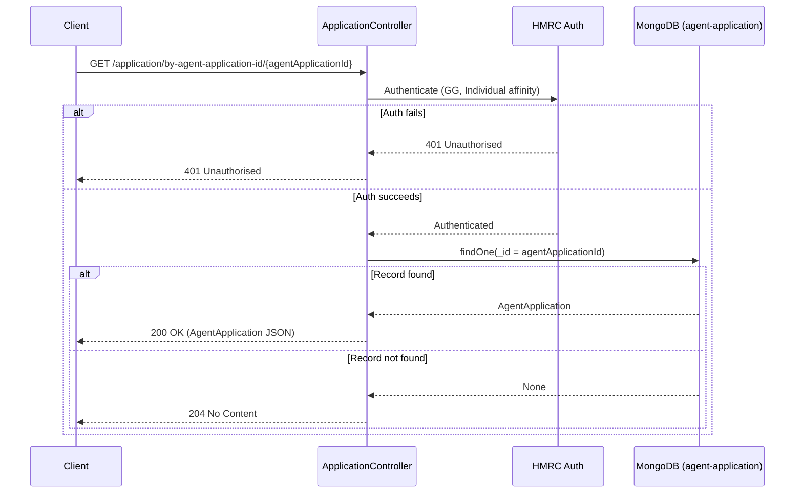

# AR03 – Get Agent Application by Agent Application ID (Individual Auth)

## Overview
Retrieves an agent application record by its MongoDB document ID (`agentApplicationId`). This endpoint is secured with Individual (not Agent) affinity, serving the individual matching journey where an individual needs to read the agent's application record. Returns 204 (not 404) when no record is found.

## API Details

| Field              | Value                                                              |
|--------------------|--------------------------------------------------------------------|
| Method             | GET                                                                |
| Path               | `/application/by-agent-application-id/{agentApplicationId}`       |
| Controller         | `ApplicationController`                                            |
| Controller Method  | `findById`                                                         |
| Audience           | Individual (Government Gateway)                                    |
| Criticality        | High                                                               |

## Authentication

- **Type:** Government Gateway (GG)
- **Affinity Group:** Individual
- **Credential Roles:** Standard GG credentials
- **Notes:** Unlike the agent-facing endpoints (AR01, AR04), this endpoint requires **Individual** affinity. This reflects its use in the matching journey where an individual user — not the agent — needs to read the application.

## Path Parameters

| Parameter            | Type   | Description                                   |
|----------------------|--------|-----------------------------------------------|
| `agentApplicationId` | String | MongoDB `_id` of the agent application record |

## Query Parameters

None

## Response

| Status Code | Description                                           |
|-------------|-------------------------------------------------------|
| 200         | Application found; returns `AgentApplication` JSON    |
| 204         | No application found for this ID                      |
| 401         | Unauthorised — authentication or affinity mismatch    |

## Service Architecture

The request is authenticated via HMRC Auth with Individual affinity. The controller queries the `agent-application` MongoDB collection by `_id` using the `agentApplicationId` path parameter.

## Interaction Flow

## Dependencies

- **HMRC Auth** — Government Gateway authentication and authorisation

## Database Collections

| Collection          | Operation | Filter |
|---------------------|-----------|--------|
| `agent-application` | findOne   | `_id`  |

## Special Cases

- Returns **204** (not 404) when no application record exists
- Requires **Individual** affinity group — Agent users cannot call this endpoint
- `agentApplicationId` maps directly to the MongoDB `_id` field

## Error Handling

- **401** for any authentication or affinity failure
- MongoDB errors propagate as 500 Internal Server Error

## Performance Considerations

- Query uses the primary key index (`_id`) — O(1) lookup
- Fully asynchronous (Play `Action.async`)
- No caching layer

## Notes

This endpoint exists specifically to support the individual matching journey. Using Individual affinity prevents agents from using it as an alternative lookup path and keeps the journey separation clean.

## Document Metadata

| Field             | Value                    |
|-------------------|--------------------------|
| API ID            | AR03                     |
| Last Updated      | 2025-07-14               |
| Git Commit SHA    | N/A                      |
| Analysis Version  | 1.0                      |
