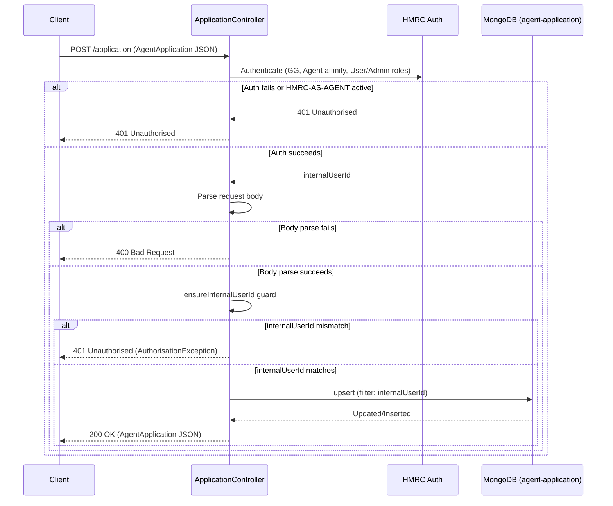

# AR04 – Create or Update Agent Application

## Overview
Creates or updates an agent application record for the authenticated agent. The operation is an upsert keyed on `internalUserId`, ensuring only one application record exists per user. Requests where the body's `internalUserId` does not match the authenticated user's ID are rejected to prevent agents from overwriting each other's applications.

## API Details

| Field              | Value                                              |
|--------------------|----------------------------------------------------|
| Method             | POST                                               |
| Path               | `/application`                                     |
| Controller         | `ApplicationController`                            |
| Controller Method  | `upsertApplication`                                |
| Audience           | Agent (Government Gateway)                         |
| Criticality        | High                                               |

## Authentication

- **Type:** Government Gateway (GG)
- **Affinity Group:** Agent
- **Credential Roles:** User or Admin
- **Notes:** The `HMRC-AS-AGENT` enrolment must **not** be active. Assistant credential role is rejected. An `ensureInternalUserId` guard verifies that the `internalUserId` in the request body matches the authenticated user — mismatch throws `AuthorisationException`.

## Path Parameters

None

## Query Parameters

None

## Response

| Status Code | Description                                                     |
|-------------|-----------------------------------------------------------------|
| 200         | Application created or updated; returns `AgentApplication` JSON |
| 400         | Invalid request body                                            |
| 401         | Unauthorised — auth failure, HMRC-AS-AGENT active, or internalUserId mismatch |

## Service Architecture

Authentication is checked first via HMRC Auth. The request body is parsed as an `AgentApplication`. The `ensureInternalUserId` guard then compares the body's `internalUserId` with the one from the auth token. On success, the `agent-application` MongoDB collection is upserted with the filter `{ internalUserId: ... }`.

## Interaction Flow

## Dependencies

- **HMRC Auth** — Government Gateway authentication and authorisation

## Database Collections

| Collection          | Operation | Filter           |
|---------------------|-----------|------------------|
| `agent-application` | upsert    | `internalUserId` |

## Special Cases

- **`ensureInternalUserId` guard** — rejects requests where body `internalUserId` ≠ authenticated user ID
- Rejects requests where `HMRC-AS-AGENT` enrolment is active
- Rejects users with the **Assistant** credential role
- Upsert semantics — safe to call repeatedly; creates on first call, updates on subsequent calls

## Error Handling

- **400** for malformed request body
- **401** for auth failure, active `HMRC-AS-AGENT` enrolment, Assistant role, or `internalUserId` mismatch
- MongoDB errors propagate as 500 Internal Server Error

## Performance Considerations

- Upsert uses the unique index on `internalUserId` for efficient matching
- Fully asynchronous (Play `Action.async`)
- No caching layer

## Notes

The `internalUserId` guard is a security control that prevents an agent from submitting a body with a different user's ID to overwrite their application. The HMRC-AS-AGENT check mirrors AR01's logic to ensure consistent rejection of already-enrolled agents.

## Document Metadata

| Field             | Value                    |
|-------------------|--------------------------|
| API ID            | AR04                     |
| Last Updated      | 2025-07-14               |
| Git Commit SHA    | N/A                      |
| Analysis Version  | 1.0                      |
