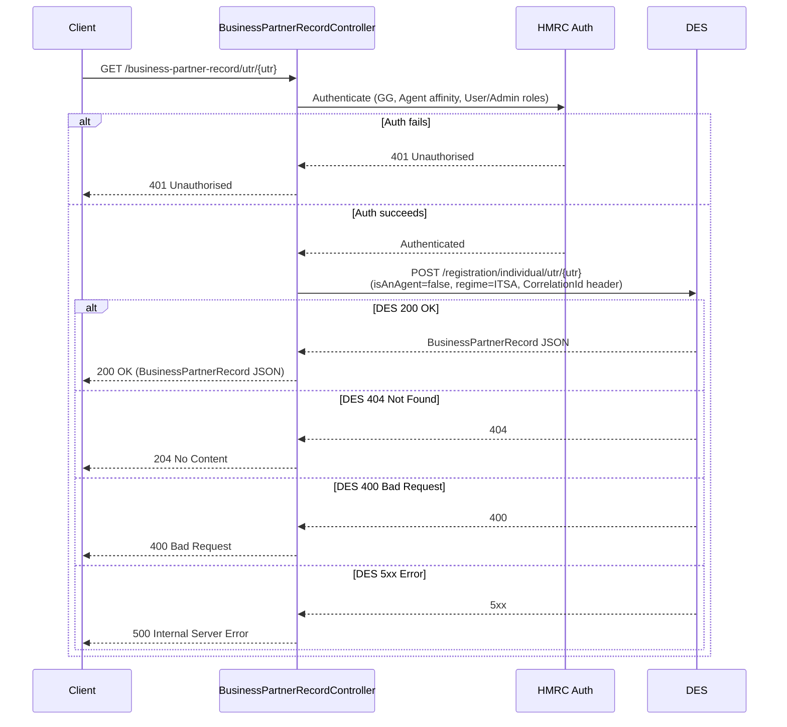

# AR05 – Get Business Partner Record by UTR (Agent Auth)

## Overview
Looks up a business partner record from DES (Data Exchange Service) for a given UTR (Unique Taxpayer Reference), under agent authentication. Despite the HTTP method being GET, the downstream DES call is a POST to DES's registration lookup endpoint. Returns 204 when DES reports no record found.

## API Details

| Field              | Value                                              |
|--------------------|----------------------------------------------------|
| Method             | GET                                                |
| Path               | `/business-partner-record/utr/{utr}`               |
| Controller         | `BusinessPartnerRecordController`                  |
| Controller Method  | `getBusinessPartnerRecord`                         |
| Audience           | Agent (Government Gateway)                         |
| Criticality        | High                                               |

## Authentication

- **Type:** Government Gateway (GG)
- **Affinity Group:** Agent
- **Credential Roles:** User or Admin
- **Notes:** Standard agent authentication. No HMRC-AS-AGENT enrolment check specific to this endpoint.

## Path Parameters

| Parameter | Type   | Description                    |
|-----------|--------|--------------------------------|
| `utr`     | String | Unique Taxpayer Reference (UTR) |

## Query Parameters

None

## Response

| Status Code | Description                                                  |
|-------------|--------------------------------------------------------------|
| 200         | Record found; returns `BusinessPartnerRecord` JSON           |
| 204         | No record found for this UTR (DES returned 404)              |
| 400         | Bad request — DES returned 400 (`BadRequestException`)       |
| 401         | Unauthorised — authentication or affinity failure            |
| 500         | Internal server error — DES returned 5xx or unexpected error |

## Service Architecture

After authentication, the controller delegates to `BusinessPartnerRecordConnector`, which calls DES via a POST request to `/registration/individual/utr/{utr}` with a fixed payload of `isAnAgent=false` and `regime=ITSA`. DES requires a `Bearer` token, an `Environment` header, and a `CorrelationId` header. The response is parsed and mapped to a `BusinessPartnerRecord`.

## Interaction Flow

## Dependencies

- **HMRC Auth** — Government Gateway authentication and authorisation
- **DES (Data Exchange Service)** — `POST /registration/individual/utr/{utr}` with headers: `Authorization: Bearer <token>`, `Environment: <env>`, `CorrelationId: <uuid>`

## Database Collections

None

## Special Cases

- The downstream DES call uses **POST** despite this being a lookup operation — this is a DES API design convention
- DES `404` is mapped to `204` (not propagated as 404)
- DES `400` is propagated as `BadRequestException` (400)
- DES `5xx` errors are mapped to 500

## Error Handling

- **401** for auth failures
- **400** if DES returns 400
- **500** if DES returns 5xx or an unexpected error occurs
- DES 404 is silently mapped to 204

## Performance Considerations

- Fully asynchronous HTTP call to DES
- No MongoDB involvement; no caching
- `CorrelationId` header aids DES-side traceability

## Notes

This endpoint is the agent-facing counterpart to AR06 (Individual affinity). They share the same connector and DES call; the only difference is the affinity group required for authentication.

## Document Metadata

| Field             | Value                    |
|-------------------|--------------------------|
| API ID            | AR05                     |
| Last Updated      | 2025-07-14               |
| Git Commit SHA    | N/A                      |
| Analysis Version  | 1.0                      |
