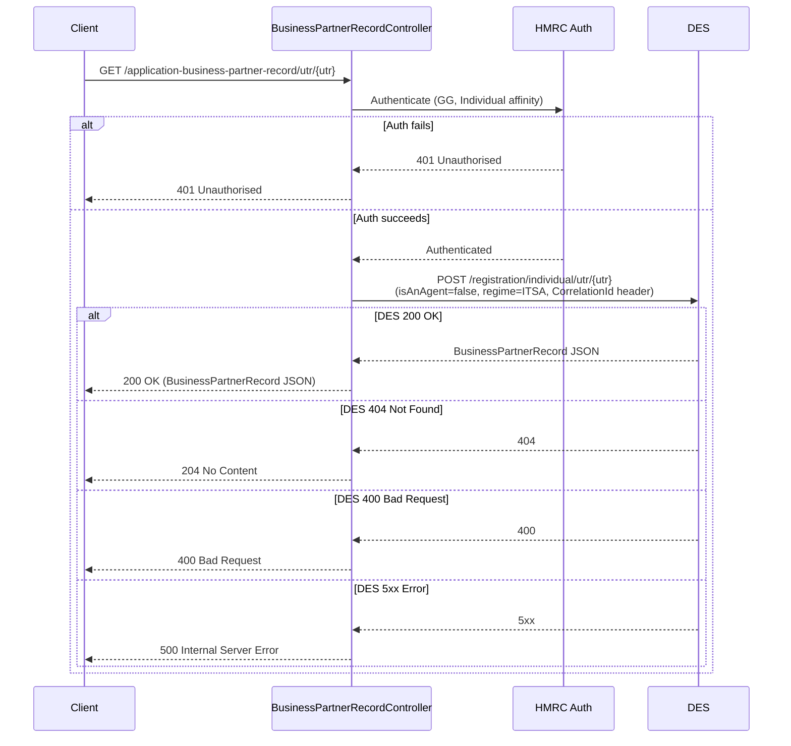

# AR06 – Get Application Business Partner Record by UTR (Individual Auth)

## Overview
Looks up a business partner record from DES (Data Exchange Service) for a given UTR (Unique Taxpayer Reference), under individual authentication. This is the individual-facing counterpart to AR05 and is used during the individual matching journey. The DES call is identical to AR05 — a POST to DES's registration lookup endpoint.

## API Details

| Field              | Value                                                         |
|--------------------|---------------------------------------------------------------|
| Method             | GET                                                           |
| Path               | `/application-business-partner-record/utr/{utr}`             |
| Controller         | `BusinessPartnerRecordController`                             |
| Controller Method  | `getApplicationBusinessPartnerRecord`                         |
| Audience           | Individual (Government Gateway)                               |
| Criticality        | High                                                          |

## Authentication

- **Type:** Government Gateway (GG)
- **Affinity Group:** Individual
- **Credential Roles:** Standard GG credentials
- **Notes:** Requires **Individual** affinity, unlike AR05 which requires Agent affinity. This separates the two journeys at the authentication layer.

## Path Parameters

| Parameter | Type   | Description                    |
|-----------|--------|--------------------------------|
| `utr`     | String | Unique Taxpayer Reference (UTR) |

## Query Parameters

None

## Response

| Status Code | Description                                                  |
|-------------|--------------------------------------------------------------|
| 200         | Record found; returns `BusinessPartnerRecord` JSON           |
| 204         | No record found for this UTR (DES returned 404)              |
| 400         | Bad request — DES returned 400 (`BadRequestException`)       |
| 401         | Unauthorised — authentication or affinity failure            |
| 500         | Internal server error — DES returned 5xx or unexpected error |

## Service Architecture

After authentication, the controller delegates to `BusinessPartnerRecordConnector`, which calls DES via a POST to `/registration/individual/utr/{utr}` with `isAnAgent=false` and `regime=ITSA`. DES requires `Bearer` token, `Environment`, and `CorrelationId` headers. This flow is identical to AR05, differing only in the authentication affinity group.

## Interaction Flow

## Dependencies

- **HMRC Auth** — Government Gateway authentication and authorisation
- **DES (Data Exchange Service)** — `POST /registration/individual/utr/{utr}` with headers: `Authorization: Bearer <token>`, `Environment: <env>`, `CorrelationId: <uuid>`

## Database Collections

None

## Special Cases

- The downstream DES call uses **POST** despite being a lookup — DES API convention
- DES `404` is mapped to `204` (not propagated)
- DES `400` is propagated as `BadRequestException` (400)
- DES `5xx` errors are mapped to 500
- This endpoint is functionally identical to AR05 but requires **Individual** (not Agent) affinity

## Error Handling

- **401** for auth failures
- **400** if DES returns 400
- **500** if DES returns 5xx or an unexpected error occurs
- DES 404 is silently mapped to 204

## Performance Considerations

- Fully asynchronous HTTP call to DES
- No MongoDB involvement; no caching
- `CorrelationId` header aids DES-side traceability

## Notes

The path prefix `application-business-partner-record` (versus `business-partner-record` in AR05) signals that this lookup is specifically in the context of an individual matching against an agent application, and may be used to maintain routing clarity between journeys.

## Document Metadata

| Field             | Value                    |
|-------------------|--------------------------|
| API ID            | AR06                     |
| Last Updated      | 2025-07-14               |
| Git Commit SHA    | N/A                      |
| Analysis Version  | 1.0                      |
