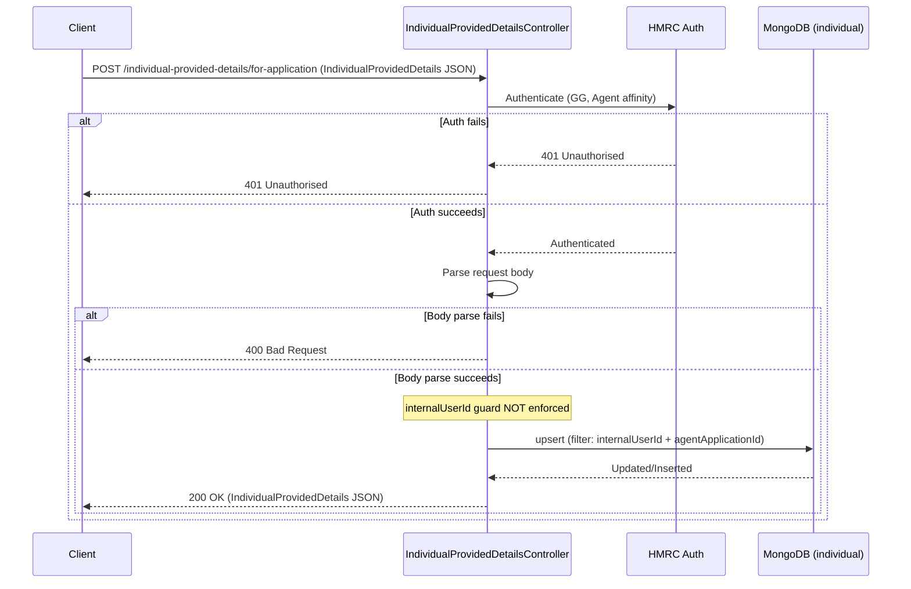

# AR07 – Upsert Individual Provided Details for Application (Agent Auth)

## Overview
Creates or updates an `IndividualProvidedDetails` record on behalf of an agent, associated with a specific agent application. Uniquely, the `internalUserId` guard is **intentionally not enforced** here, allowing the agent to pre-create individual records before the individual themselves has signed in and provided their own details.

## API Details

| Field              | Value                                                          |
|--------------------|----------------------------------------------------------------|
| Method             | POST                                                           |
| Path               | `/individual-provided-details/for-application`                 |
| Controller         | `IndividualProvidedDetailsController`                          |
| Controller Method  | `upsertForApplication`                                         |
| Audience           | Agent (Government Gateway)                                     |
| Criticality        | High                                                           |

## Authentication

- **Type:** Government Gateway (GG)
- **Affinity Group:** Agent
- **Credential Roles:** Standard GG Agent credentials
- **Notes:** The `internalUserId` guard found in other upsert endpoints is **intentionally NOT enforced** here. This is a deliberate design decision to allow agents to pre-populate individual records before the individual user is present in the system.

## Path Parameters

None

## Query Parameters

None

## Response

| Status Code | Description                                                              |
|-------------|--------------------------------------------------------------------------|
| 200         | Record created or updated; returns `IndividualProvidedDetails` JSON      |
| 400         | Invalid request body                                                      |
| 401         | Unauthorised — authentication or affinity failure                         |

## Service Architecture

After authentication, the request body is parsed as `IndividualProvidedDetails`. The `individual` MongoDB collection is upserted with a compound filter on `internalUserId` + `agentApplicationId`. The collection has a TTL index on `lastUpdated` and a unique partial index on the same compound key.

## Interaction Flow

## Dependencies

- **HMRC Auth** — Government Gateway authentication and authorisation

## Database Collections

| Collection   | Operation | Filter                                   |
|--------------|-----------|------------------------------------------|
| `individual` | upsert    | `internalUserId` + `agentApplicationId`  |

## Special Cases

- The `internalUserId` guard is **intentionally NOT enforced** — agents can write records for individuals who haven't yet signed in
- Unique partial index on `internalUserId` + `agentApplicationId` prevents duplicate records
- TTL index on `lastUpdated` — records expire automatically
- Upsert semantics — idempotent; safe to call repeatedly

## Error Handling

- **400** for malformed request body
- **401** for auth failures
- MongoDB errors propagate as 500 Internal Server Error

## Performance Considerations

- Upsert uses a compound partial index for efficient matching
- Fully asynchronous (Play `Action.async`)
- No caching layer

## Notes

The deliberate omission of the `internalUserId` guard distinguishes AR07 from AR11 (the individual counterpart). This supports a pre-creation pattern where the agent sets up the scaffold before the individual completes their matching journey.

## Document Metadata

| Field             | Value                    |
|-------------------|--------------------------|
| API ID            | AR07                     |
| Last Updated      | 2025-07-14               |
| Git Commit SHA    | N/A                      |
| Analysis Version  | 1.0                      |
