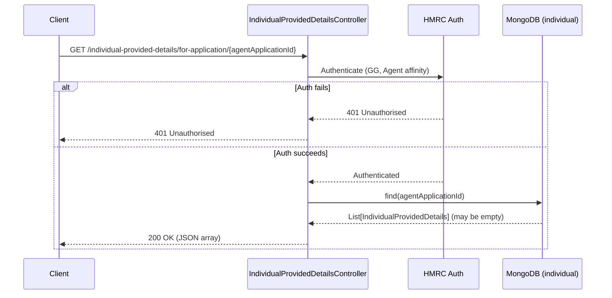

# AR08 – Get Individual Provided Details for Application (Agent Auth)

## Overview
Retrieves all `IndividualProvidedDetails` records associated with a given agent application ID, under agent authentication. Always returns 200 — an empty array is returned when no records exist. This endpoint is used by agents to view the individual details linked to their application.

## API Details

| Field              | Value                                                          |
|--------------------|----------------------------------------------------------------|
| Method             | GET                                                            |
| Path               | `/individual-provided-details/for-application/{agentApplicationId}` |
| Controller         | `IndividualProvidedDetailsController`                          |
| Controller Method  | `findForApplication`                                           |
| Audience           | Agent (Government Gateway)                                     |
| Criticality        | High                                                           |

## Authentication

- **Type:** Government Gateway (GG)
- **Affinity Group:** Agent
- **Credential Roles:** Standard GG Agent credentials
- **Notes:** Standard agent authentication. No special enrolment checks beyond affinity group.

## Path Parameters

| Parameter            | Type   | Description                                         |
|----------------------|--------|-----------------------------------------------------|
| `agentApplicationId` | String | The agent application ID to find individual details for |

## Query Parameters

None

## Response

| Status Code | Description                                                           |
|-------------|-----------------------------------------------------------------------|
| 200         | Returns JSON array of `IndividualProvidedDetails` (may be empty `[]`) |
| 401         | Unauthorised — authentication or affinity failure                      |

## Service Architecture

After authentication, the controller queries the `individual` MongoDB collection for all documents matching the `agentApplicationId`. The collection has an index on `agentApplicationId` to support this query efficiently. The result is always a list (possibly empty), so 204 is never returned.

## Interaction Flow

## Dependencies

- **HMRC Auth** — Government Gateway authentication and authorisation

## Database Collections

| Collection   | Operation | Filter               |
|--------------|-----------|----------------------|
| `individual` | find      | `agentApplicationId` |

## Special Cases

- Always returns **200** — an empty array `[]` is returned if no records exist (no 204)
- Multiple records can exist per `agentApplicationId`
- AR09 uses the identical query but with Individual affinity

## Error Handling

- **401** for auth failures
- MongoDB errors propagate as 500 Internal Server Error

## Performance Considerations

- Query uses an index on `agentApplicationId` for efficient multi-document lookup
- Fully asynchronous (Play `Action.async`)
- No caching layer

## Notes

This endpoint and AR09 share the same MongoDB query. The difference is purely in the authentication affinity group, separating the agent view from the individual matching view.

## Document Metadata

| Field             | Value                    |
|-------------------|--------------------------|
| API ID            | AR08                     |
| Last Updated      | 2025-07-14               |
| Git Commit SHA    | N/A                      |
| Analysis Version  | 1.0                      |
