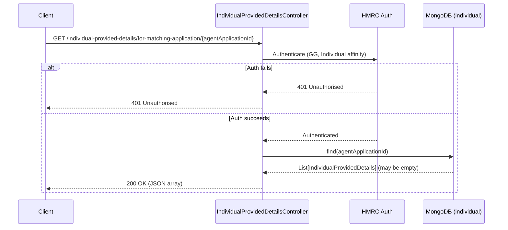

# AR09 – Get Individual Provided Details for Matching Application (Individual Auth)

## Overview
Retrieves all `IndividualProvidedDetails` records associated with a given agent application ID, under individual authentication. This is the individual-facing counterpart to AR08 and is used during the matching journey. The MongoDB query is identical to AR08 — only the required affinity group differs.

## API Details

| Field              | Value                                                                                 |
|--------------------|---------------------------------------------------------------------------------------|
| Method             | GET                                                                                   |
| Path               | `/individual-provided-details/for-matching-application/{agentApplicationId}`          |
| Controller         | `IndividualProvidedDetailsController`                                                 |
| Controller Method  | `findForMatchingWithApplication`                                                      |
| Audience           | Individual (Government Gateway)                                                       |
| Criticality        | High                                                                                  |

## Authentication

- **Type:** Government Gateway (GG)
- **Affinity Group:** Individual
- **Credential Roles:** Standard GG credentials
- **Notes:** Requires **Individual** affinity. This mirrors AR08 but is accessible to Individual users for the matching journey.

## Path Parameters

| Parameter            | Type   | Description                                         |
|----------------------|--------|-----------------------------------------------------|
| `agentApplicationId` | String | The agent application ID to find individual details for |

## Query Parameters

None

## Response

| Status Code | Description                                                           |
|-------------|-----------------------------------------------------------------------|
| 200         | Returns JSON array of `IndividualProvidedDetails` (may be empty `[]`) |
| 401         | Unauthorised — authentication or affinity failure                      |

## Service Architecture

After authentication (Individual affinity), the controller queries the `individual` MongoDB collection for all documents matching the `agentApplicationId`. The query and return type are identical to AR08. The path prefix `for-matching-application` (versus `for-application`) signals the context.

## Interaction Flow

## Dependencies

- **HMRC Auth** — Government Gateway authentication and authorisation

## Database Collections

| Collection   | Operation | Filter               |
|--------------|-----------|----------------------|
| `individual` | find      | `agentApplicationId` |

## Special Cases

- Always returns **200** — an empty array `[]` is returned if no records exist (no 204)
- Identical MongoDB query to AR08 — only auth affinity differs
- Path segment `for-matching-application` distinguishes from the agent-facing `for-application` (AR08)

## Error Handling

- **401** for auth failures
- MongoDB errors propagate as 500 Internal Server Error

## Performance Considerations

- Query uses an index on `agentApplicationId` for efficient multi-document lookup
- Fully asynchronous (Play `Action.async`)
- No caching layer

## Notes

The separate path and affinity requirement for this endpoint versus AR08 is a deliberate design choice: it keeps the individual matching journey clearly separated from the agent management journey, avoiding any ambiguity about who is reading the data.

## Document Metadata

| Field             | Value                    |
|-------------------|--------------------------|
| API ID            | AR09                     |
| Last Updated      | 2025-07-14               |
| Git Commit SHA    | N/A                      |
| Analysis Version  | 1.0                      |
