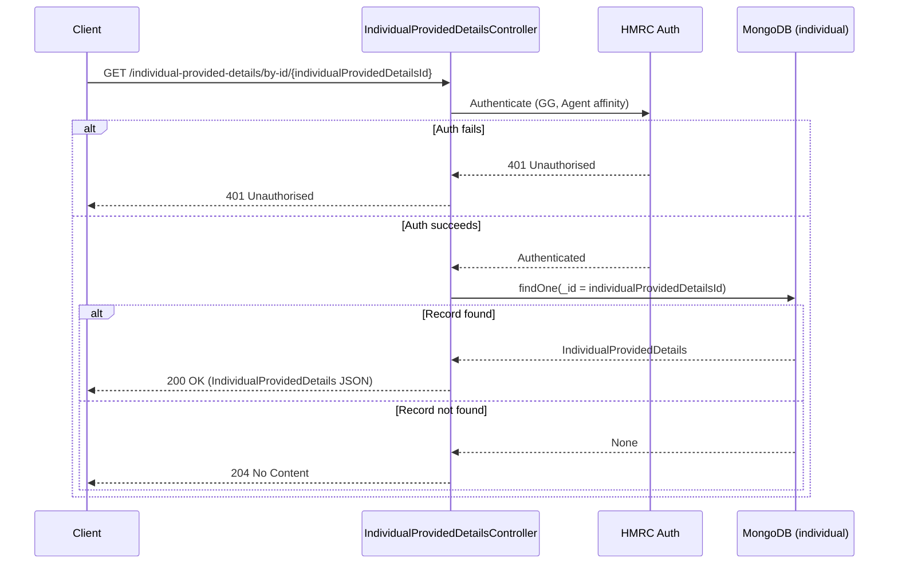

# AR10 – Get Individual Provided Details by ID (Agent Auth)

## Overview
Retrieves a single `IndividualProvidedDetails` record by its MongoDB document ID, under agent authentication. Returns 204 (not 404) when the record does not exist, consistent with the service-wide convention for missing document lookups.

## API Details

| Field              | Value                                                                     |
|--------------------|---------------------------------------------------------------------------|
| Method             | GET                                                                       |
| Path               | `/individual-provided-details/by-id/{individualProvidedDetailsId}`        |
| Controller         | `IndividualProvidedDetailsController`                                     |
| Controller Method  | `findById`                                                                |
| Audience           | Agent (Government Gateway)                                                |
| Criticality        | High                                                                      |

## Authentication

- **Type:** Government Gateway (GG)
- **Affinity Group:** Agent
- **Credential Roles:** Standard GG Agent credentials
- **Notes:** Standard agent authentication.

## Path Parameters

| Parameter                    | Type   | Description                                    |
|------------------------------|--------|------------------------------------------------|
| `individualProvidedDetailsId` | String | MongoDB `_id` of the `IndividualProvidedDetails` record |

## Query Parameters

None

## Response

| Status Code | Description                                                    |
|-------------|----------------------------------------------------------------|
| 200         | Record found; returns `IndividualProvidedDetails` JSON         |
| 204         | No record found for this ID                                    |
| 401         | Unauthorised — authentication or affinity failure              |

## Service Architecture

After authentication, the controller queries the `individual` MongoDB collection by `_id` using the `individualProvidedDetailsId` path parameter.

## Interaction Flow

## Dependencies

- **HMRC Auth** — Government Gateway authentication and authorisation

## Database Collections

| Collection   | Operation | Filter |
|--------------|-----------|--------|
| `individual` | findOne   | `_id`  |

## Special Cases

- Returns **204** (not 404) when no record exists
- `individualProvidedDetailsId` maps directly to the MongoDB `_id` field

## Error Handling

- **401** for auth failures
- MongoDB errors propagate as 500 Internal Server Error

## Performance Considerations

- Query uses the primary key index (`_id`) — O(1) lookup
- Fully asynchronous (Play `Action.async`)
- No caching layer

## Notes

This is the point-lookup counterpart to AR08/AR09 which retrieve lists. It is used when the caller already has the specific record ID (e.g. obtained from a prior list call).

## Document Metadata

| Field             | Value                    |
|-------------------|--------------------------|
| API ID            | AR10                     |
| Last Updated      | 2025-07-14               |
| Git Commit SHA    | N/A                      |
| Analysis Version  | 1.0                      |
