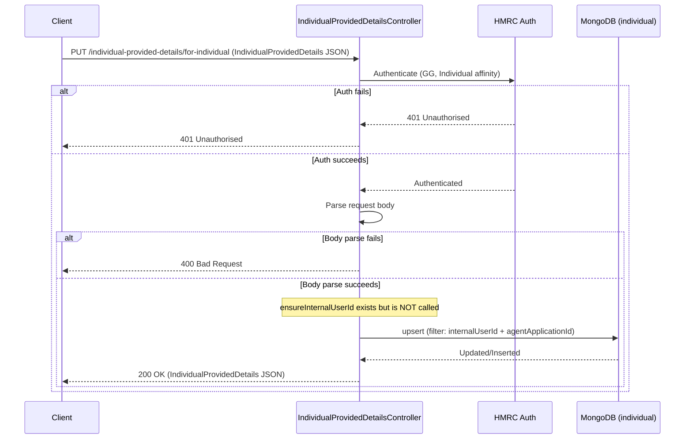

# AR11 – Upsert Individual Provided Details for Individual (Individual Auth)

## Overview
Creates or updates an `IndividualProvidedDetails` record submitted by an individual user during the matching journey. This is the individual-facing counterpart to AR07 (agent-facing). While the controller code contains an `ensureInternalUserId` helper, it is **not called** in this method — a notable design detail.

## API Details

| Field              | Value                                                      |
|--------------------|------------------------------------------------------------|
| Method             | PUT                                                        |
| Path               | `/individual-provided-details/for-individual`              |
| Controller         | `IndividualProvidedDetailsController`                      |
| Controller Method  | `upsert`                                                   |
| Audience           | Individual (Government Gateway)                            |
| Criticality        | High                                                       |

## Authentication

- **Type:** Government Gateway (GG)
- **Affinity Group:** Individual
- **Credential Roles:** Standard GG credentials
- **Notes:** Requires **Individual** affinity. The `ensureInternalUserId` guard is present in the controller code but is **not invoked** in this method — unlike AR04 where it is enforced. This may be intentional or a future TODO.

## Path Parameters

None

## Query Parameters

None

## Response

| Status Code | Description                                                            |
|-------------|------------------------------------------------------------------------|
| 200         | Record created or updated; returns `IndividualProvidedDetails` JSON    |
| 400         | Invalid request body                                                    |
| 401         | Unauthorised — authentication or affinity failure                       |

## Service Architecture

After authentication (Individual affinity), the request body is parsed as `IndividualProvidedDetails`. The `individual` MongoDB collection is upserted with a compound filter on `internalUserId` + `agentApplicationId`. No `internalUserId` guard is enforced despite one existing in the controller.

## Interaction Flow

## Dependencies

- **HMRC Auth** — Government Gateway authentication and authorisation

## Database Collections

| Collection   | Operation | Filter                                   |
|--------------|-----------|------------------------------------------|
| `individual` | upsert    | `internalUserId` + `agentApplicationId`  |

## Special Cases

- The `ensureInternalUserId` guard exists in the controller but is **NOT called** — this may be intentional or a design gap
- Requires **Individual** affinity (counterpart AR07 requires Agent affinity)
- Upsert semantics — idempotent and safe to call repeatedly
- TTL index on `lastUpdated` — records expire automatically
- Unique partial index on `internalUserId` + `agentApplicationId`

## Error Handling

- **400** for malformed request body
- **401** for auth failures
- MongoDB errors propagate as 500 Internal Server Error

## Performance Considerations

- Upsert uses a compound partial index for efficient matching
- Fully asynchronous (Play `Action.async`)
- No caching layer

## Notes

The absence of the `internalUserId` guard call (despite the helper existing) should be reviewed — it is unclear whether this is intentional (trusting the individual's own session) or an oversight. Compare with AR04 where the guard is explicitly enforced.

## Document Metadata

| Field             | Value                    |
|-------------------|--------------------------|
| API ID            | AR11                     |
| Last Updated      | 2025-07-14               |
| Git Commit SHA    | N/A                      |
| Analysis Version  | 1.0                      |
