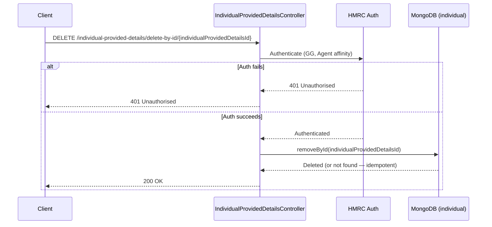

# AR12 – Delete Individual Provided Details by ID (Agent Auth)

## Overview
Deletes a single `IndividualProvidedDetails` record by its MongoDB document ID, under agent authentication. The operation is idempotent — a 200 is returned regardless of whether the record existed, simplifying client-side error handling in cleanup scenarios.

## API Details

| Field              | Value                                                                        |
|--------------------|------------------------------------------------------------------------------|
| Method             | DELETE                                                                       |
| Path               | `/individual-provided-details/delete-by-id/{individualProvidedDetailsId}`   |
| Controller         | `IndividualProvidedDetailsController`                                        |
| Controller Method  | `deleteById`                                                                 |
| Audience           | Agent (Government Gateway)                                                   |
| Criticality        | High                                                                         |

## Authentication

- **Type:** Government Gateway (GG)
- **Affinity Group:** Agent
- **Credential Roles:** Standard GG Agent credentials
- **Notes:** Standard agent authentication.

## Path Parameters

| Parameter                    | Type   | Description                                              |
|------------------------------|--------|----------------------------------------------------------|
| `individualProvidedDetailsId` | String | MongoDB `_id` of the `IndividualProvidedDetails` record to delete |

## Query Parameters

None

## Response

| Status Code | Description                                                     |
|-------------|-----------------------------------------------------------------|
| 200         | Record deleted (or did not exist — idempotent)                  |
| 401         | Unauthorised — authentication or affinity failure               |

## Service Architecture

After authentication, the controller calls `removeById` on the `individual` MongoDB collection using the `individualProvidedDetailsId` path parameter. The result is always 200 regardless of whether a document was matched and deleted.

## Interaction Flow

## Dependencies

- **HMRC Auth** — Government Gateway authentication and authorisation

## Database Collections

| Collection   | Operation  | Filter |
|--------------|------------|--------|
| `individual` | removeById | `_id`  |

## Special Cases

- Returns **200** regardless of whether the record existed — **idempotent delete**
- No 404 is returned; callers do not need to check for existence before deleting
- `individualProvidedDetailsId` maps directly to the MongoDB `_id` field

## Error Handling

- **401** for auth failures
- MongoDB errors propagate as 500 Internal Server Error
- No 404 — non-existence is treated as a successful delete

## Performance Considerations

- Delete uses the primary key index (`_id`) — O(1) operation
- Fully asynchronous (Play `Action.async`)
- No caching layer

## Notes

The idempotent delete behaviour simplifies cleanup workflows — callers such as a cleanup task or retry handler do not need to pre-check existence. This is consistent with a "delete if exists" semantic rather than a strict "delete existing record" semantic.

## Document Metadata

| Field             | Value                    |
|-------------------|--------------------------|
| API ID            | AR12                     |
| Last Updated      | 2025-07-14               |
| Git Commit SHA    | N/A                      |
| Analysis Version  | 1.0                      |
