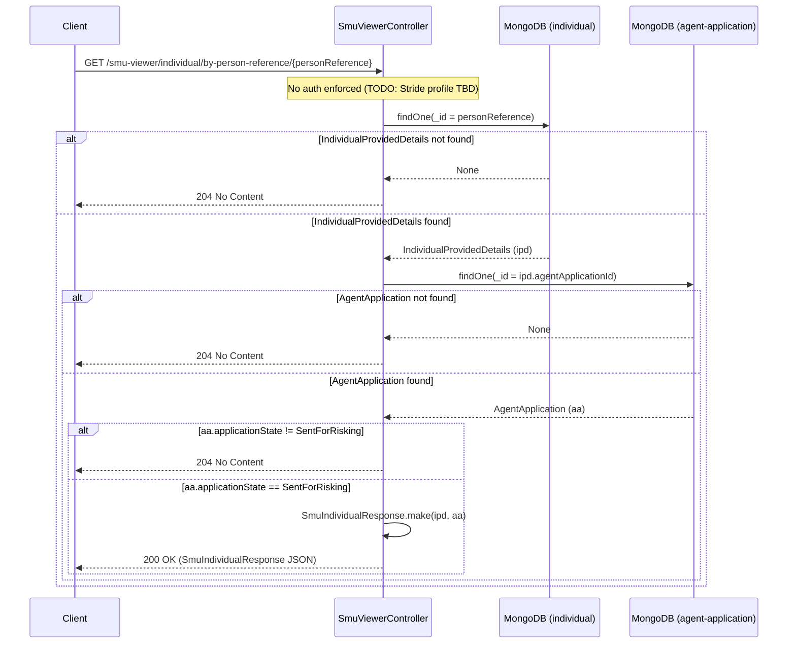

# AR13 – Get SMU Individual by Person Reference (No Auth — TODO)

## Overview
Retrieves an aggregated `SmuIndividualResponse` for the SMU (Supervised Money Undertakings) viewer by resolving a `personReference` to an `IndividualProvidedDetails` record and its associated `AgentApplication`. The response is only returned if both records exist and the application is in the `SentForRisking` state. Authentication is not yet enforced (TODO: Stride profile to be determined).

## API Details

| Field              | Value                                                                        |
|--------------------|------------------------------------------------------------------------------|
| Method             | GET                                                                          |
| Path               | `/smu-viewer/individual/by-person-reference/{personReference}`               |
| Controller         | `SmuViewerController`                                                        |
| Controller Method  | `findIndividualByPersonReference`                                            |
| Audience           | SMU Viewer (internal — auth TODO)                                            |
| Criticality        | High                                                                         |

## Authentication

- **Type:** None (currently uses `actions.default`)
- **Notes:** Authentication is **not yet enforced**. A TODO comment in the controller indicates that the Stride profile for this endpoint has not yet been determined. This is a known gap and must be addressed before production use.

## Path Parameters

| Parameter         | Type   | Description                                                      |
|-------------------|--------|------------------------------------------------------------------|
| `personReference` | String | Used as `_id` to look up the `IndividualProvidedDetails` record  |

## Query Parameters

None

## Response

| Status Code | Description                                                                                                              |
|-------------|--------------------------------------------------------------------------------------------------------------------------|
| 200         | Both records found and application is in `SentForRisking` state; returns `SmuIndividualResponse` JSON                   |
| 204         | Either the IPD record is missing, the application record is missing, or the application is not in `SentForRisking` state |

## Service Architecture

The controller performs two sequential MongoDB queries:

1. **Query 1:** Look up `IndividualProvidedDetails` by `_id = personReference` in the `individual` collection
2. **Query 2:** (only if step 1 succeeds) Look up `AgentApplication` by `_id = ipd.agentApplicationId` in the `agent-application` collection

If both are found and the application state is `SentForRisking`, `SmuIndividualResponse.make(ipd, aa)` is called to build the aggregated response. In all other cases, 204 is returned. Business-type-specific fields apply: `businessDetails` and `deceasedCheckResult` are included for `SoleTrader`; `companyStatusCheckResult` for `LLP`, `LimitedCompany`, etc.

## Interaction Flow

## Dependencies

None (authentication TODO — Stride profile not yet determined)

## Database Collections

| Collection          | Operation | Filter               |
|---------------------|-----------|----------------------|
| `individual`        | findOne   | `_id`                |
| `agent-application` | findOne   | `_id` (from ipd.agentApplicationId) |

## Special Cases

- **Authentication is not enforced** (TODO: Stride profile to be determined)
- Returns **204** in all non-success cases: IPD missing, application missing, or application not in `SentForRisking` state
- Two **sequential** MongoDB queries — second query only executes if the first succeeds
- `SmuIndividualResponse.make(ipd, aa)` aggregates both records into a single response model
- `businessDetails` and `deceasedCheckResult` are included only for `SoleTrader` business type
- `companyStatusCheckResult` is included for `LLP`, `LimitedCompany`, and similar entity types

## Error Handling

- No auth errors (auth not enforced)
- 204 is returned for all "not found" or "wrong state" scenarios — no error codes exposed
- MongoDB errors propagate as 500 Internal Server Error

## Performance Considerations

- Two sequential MongoDB queries — O(1) each (both use `_id` primary key)
- Fully asynchronous (Play `Action.async`)
- No caching layer
- Sequential (not parallel) queries due to dependency between them

## Notes

**Security risk:** This endpoint currently has no authentication. The TODO indicates a Stride profile should be applied. This must be resolved before the endpoint is exposed in a production environment. Until then, access relies solely on network-level controls.

## Document Metadata

| Field             | Value                    |
|-------------------|--------------------------|
| API ID            | AR13                     |
| Last Updated      | 2025-07-14               |
| Git Commit SHA    | N/A                      |
| Analysis Version  | 1.0                      |
