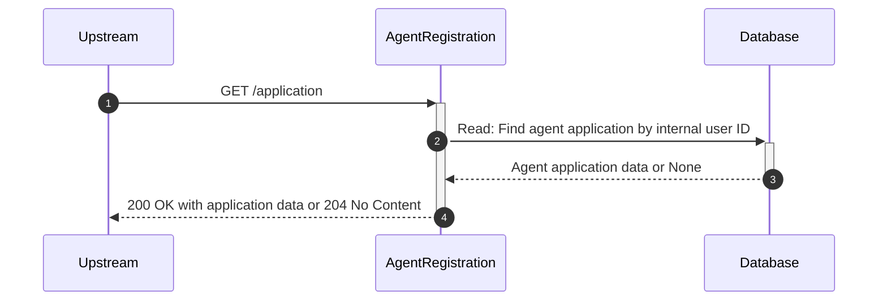
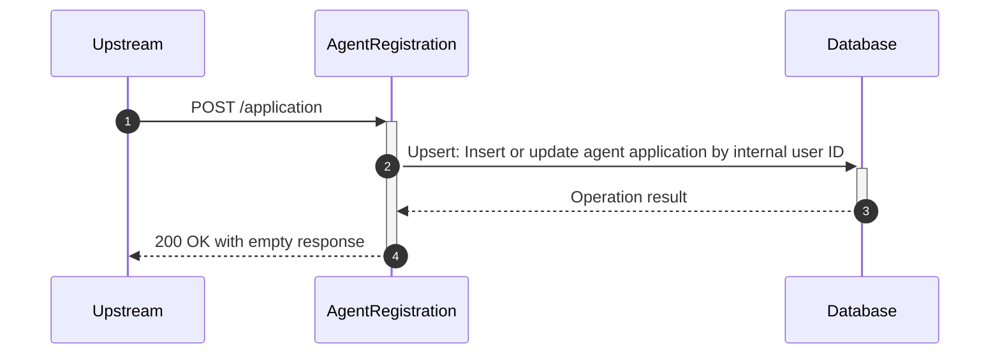

# agent-registration

## ApplicationController

---

## `GET /application`

**Description:** Retrieves an agent application by the authenticated user's internal user ID

### GET Application - Sequence of Interactions

1. **Database:** Read: Find agent application by internal user ID from the agent-application collection

### GET Application - Sequence Diagram

---

## `POST /application`

**Description:** Creates or updates an agent application for the authenticated user

### POST Application - Sequence of Interactions

1. **Database:** Upsert: Insert or update agent application by internal user ID in the agent-application collection

### POST Application - Sequence Diagram

